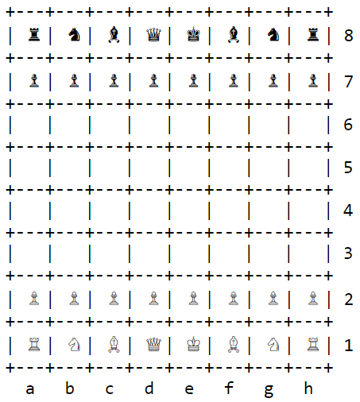

# [ascii-chess](https://zalo.github.io/ascii-chess/)

### A quick and dirty stockfish frontend for experimenting with chess ai.

Use your mouse to drag pieces around; only valid moves will register.

## Credits

ascii-chess is based on [stockfish.wasm](https://github.com/niklasf/stockfish.wasm) by @niklasf